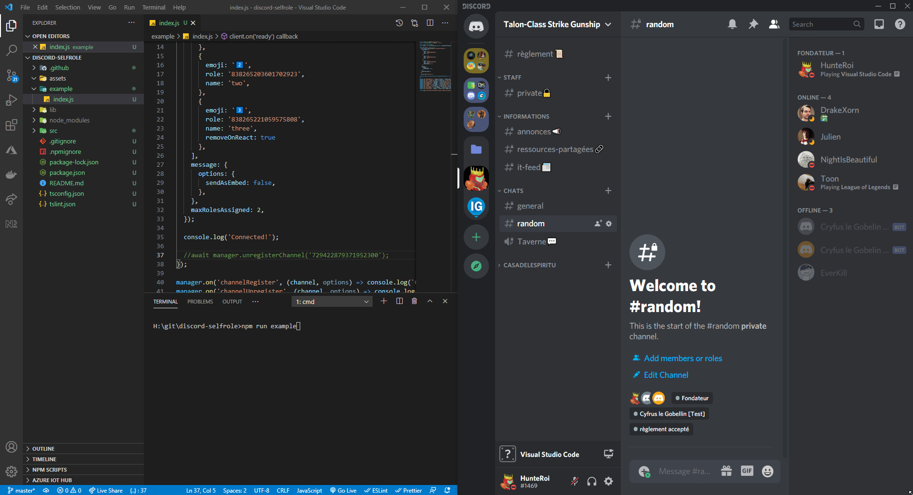

<a href="https://www.npmjs.com/@hunteroi/discord-selfrole"></a>
<a href="https://www.npmjs.com/@hunteroi/discord-selfrole"></a>

# Discord SelfRole

Discord SelfRole is a framework to easily create a channel with automated role-giver system.

- Supports custom emojis
- Emits events like `channelRegister`, `roleAdd`, `reactionRemove` and **9 more**!
- Allow full customization of the embed (you can add image, thumbnail, etc.)
- And much more!



## Prerequisites ⚠️

Starting at **v2.0.0**, you must use **NodeJS v16.6.0 or higher** to run a bot with this library.

You also must not forget to include [mandatory intents and partials](#mandatory-intents) as well as give your bot the rights to read messages.

### Mandatory intents

- GUILDS: used to access guild content such as channels.
- GUILD_MEMBERS: used to access guild members and update their roles.
- GUILD_MESSAGES: used to read guild messages.

In case you are willing to use reactions, you will need these intents:

- GUILD_MESSAGE_REACTIONS: used to access guild messages reactions.

In case you are willing to use interactions and buttons, you will need these intents:

- GUILD_INTERACTIONS: used to access direct messages to the bot.

## Installation

```sh
npm install --save @hunteroi/discord-selfrole
```

## Examples

See [./example/index.js](example/index.js).

## Events

```ts
manager.on(SelfRoleManagerEvents.channelRegister, (channel, options) => {});

manager.on(SelfRoleManagerEvents.channelUnregister, (channel, options) => {});

manager.on(SelfRoleManagerEvents.error, (error, message) => {}));

manager.on(SelfRoleManagerEvents.messageRetrieve, (message) => {});

manager.on(SelfRoleManagerEvents.messageCreate, (message) => {});

manager.on(SelfRoleManagerEvents.messageDelete, (message) => {});

manager.on(SelfRoleManagerEvents.roleRemove, (role, member, interaction) => {});

manager.on(SelfRoleManagerEvents.roleAdd, (role, member, interaction) => {});

manager.on(SelfRoleManagerEvents.reactionAdd, (rte, message) => {});

manager.on(SelfRoleManagerEvents.reactionRemove, (rte, message) => {});

manager.on(SelfRoleManagerEvents.maxRolesReach, (member, interaction, nbRoles, maxRoles) => {});
```

## Contribution

Contributions are what make the open source community such an amazing place to be learn, inspire, and create. Any contributions you make are greatly appreciated.

1. Fork the Project
2. Create your Branch: `git checkout -b patch/YourAmazingWork`
3. Commit your Changes: `git commit -m 'Add some amazing work'`
4. Push to the Branch: `git push origin patch/YourAmazingWork`
5. Open a Pull Request
